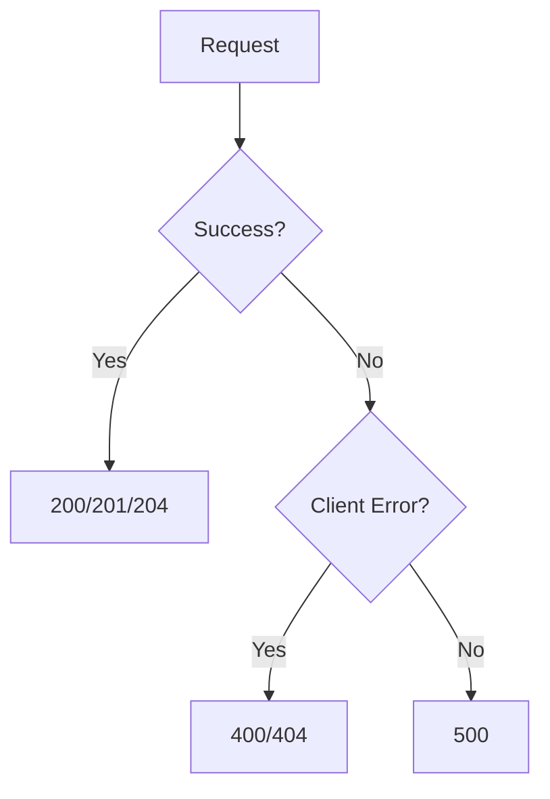

# FastAPI Response Examples Documentation

## 📚 Core Concepts

### 1. HTTP Status Codes
FastAPI uses standard HTTP status codes to indicate request outcomes:
- `200 OK`: Successful request
- `201 Created`: Resource successfully created
- `204 No Content`: Successful request with empty response
- `400 Bad Request`: Invalid client input
- `404 Not Found`: Resource doesn't exist
- `500 Internal Server Error`: Server-side error

### 2. Response Types
- **Basic Dict**: Automatically converted to JSON
- **JSONResponse**: For explicit control over status codes and headers
- **Empty Response**: For 204 No Content responses

### 3. Status Code Specification
Three ways to set status codes:
1. Default status codes (200 for GET, 201 for POST)
2. `status_code` parameter in route decorators
3. Explicitly returning status codes with responses

---

## 🛣️ API Endpoints

### 1. Basic Success Response
**Endpoint:** `GET /ok`  
**Status Code:** 200 (default)  
**Purpose:** Standard successful operation

**Response:**
```json
{
  "message": "Everything is OK"
}
```

**Implementation:**
```python
@router.get("/ok")
def ok_response():
    return {"message": "Everything is OK"}
```

---

### 2. Resource Creation
**Endpoint:** `POST /created`  
**Status Code:** 201 (explicitly set)  
**Purpose:** Successful resource creation

**Response:**
```json
{
  "message": "Resource created"
}
```

**Implementation:**
```python
@router.post("/created", status_code=status.HTTP_201_CREATED)
def created_response():
    return {"message": "Resource created"}
```

---

### 3. Conditional Response
**Endpoint:** `GET /not-found/{item_id}`  
**Status Codes:**
- 200 if item exists
- 404 if item doesn't exist

**Example Requests:**
```http
GET /not-found/1  # Exists → 200
GET /not-found/99 # Doesn't exist → 404
```

**Responses:**
```json
// 200 Response
{
  "item": "Apple"
}

// 404 Response
{
  "detail": "Item not found"
}
```

**Implementation:**
```python
@router.get("/not-found/{item_id}")
def not_found(item_id: int):
    fake_db = {1: "Apple", 2: "Banana"}
    if item_id in fake_db:
        return {"item": fake_db[item_id]}
    return {"detail": "Item not found"}, status.HTTP_404_NOT_FOUND
```

---

### 4. Empty Response
**Endpoint:** `DELETE /deleted`  
**Status Code:** 204 (explicitly set)  
**Purpose:** Successful deletion with no content

**Response Body:** None

**Implementation:**
```python
@router.delete("/deleted", status_code=status.HTTP_204_NO_CONTENT)
def delete_item():
    return
```

---

### 5. Error Responses

#### Bad Request (400)
**Endpoint:** `GET /bad-request`  
**Purpose:** Simulate invalid client input

**Response:**
```json
{
  "error": "Bad request. Your input was invalid."
}
```

**Implementation:**
```python
@router.get("/bad-request")
def bad_request():
    return JSONResponse(
        content={"error": "Bad request. Your input was invalid."},
        status_code=status.HTTP_400_BAD_REQUEST
    )
```

#### Server Error (500)
**Endpoint:** `GET /error`  
**Purpose:** Simulate server failure

**Response:**
```json
{
  "error": "Something went wrong"
}
```

**Implementation:**
```python
@router.get("/error")
def error_response():
    return JSONResponse(
        content={"error": "Something went wrong"},
        status_code=status.HTTP_500_INTERNAL_SERVER_ERROR
    )
```

---

## 🧩 Complete Router Setup
```python
from fastapi import APIRouter, status
from fastapi.responses import JSONResponse

router = APIRouter()

# [All endpoint implementations shown above]
```

---

## 🚀 Usage Patterns

### 1. Returning Different Status Codes
```python
# Method 1: Decorator parameter
@router.post("/items", status_code=201)

# Method 2: Return tuple
return data, status.HTTP_201_CREATED

# Method 3: JSONResponse
return JSONResponse(..., status_code=400)
```

### 2. Response Structure Best Practices
- Success: Include `message` or `data` field
- Errors: Use `detail` or `error` field
- 404: Always specify what wasn't found
- 400: Include validation details when available

### 3. Testing Recommendations
```bash
# Test happy path
curl -X GET http://localhost:8000/ok

# Test error case
curl -X GET http://localhost:8000/not-found/99 -v
```
Here's a comprehensive table of all HTTP status codes used in your FastAPI implementation, presented in Markdown format:

---
## 📊 HTTP Status Codes Reference Table

| Status Code | Name                  | Endpoint               | Trigger Condition                     | Response Body Example                |
|-------------|-----------------------|------------------------|---------------------------------------|--------------------------------------|
| 200         | OK                    | `GET /ok`              | Standard successful request           | `{"message": "Everything is OK"}`    |
| 200         | OK                    | `GET /not-found/{id}`  | When item exists in fake DB           | `{"item": "Apple"}`                  |
| 201         | Created               | `POST /created`        | Resource created successfully         | `{"message": "Resource created"}`    |
| 204         | No Content            | `DELETE /deleted`      | Successful deletion                   | (Empty response)                     |
| 400         | Bad Request           | `GET /bad-request`     | Invalid client input                  | `{"error": "Bad request..."}`        |
| 404         | Not Found             | `GET /not-found/{id}`  | When item doesn't exist in fake DB    | `{"detail": "Item not found"}`       |
| 500         | Internal Server Error | `GET /error`           | Server-side error occurred            | `{"error": "Something went wrong"}`  |

---
### Key Explanations:

1. **2xx Success Codes**
   - `200 OK`: Default success status for GET requests
   - `201 Created`: Specifically for resource creation
   - `204 No Content`: For successful operations with no return data

2. **4xx Client Errors**
   - `400 Bad Request`: Client-side validation errors
   - `404 Not Found`: Resource doesn't exist at specified URL

3. **5xx Server Errors**  
   - `500 Internal Server Error`: Catch-all for server-side failures

### Visual Flowchart of Status Codes


### Best Practices
1. Use `200` for standard successful GET requests
2. Return `201` + Location header when creating resources
3. Prefer `404` over `400` when the URL itself is invalid
4. Reserve `500` for unexpected server-side exceptions
5. Always include descriptive messages in error responses

### Testing Cheat Sheet
```bash
# Test all status codes
curl -X GET http://localhost:8000/ok                 # 200
curl -X POST http://localhost:8000/created           # 201 
curl -X DELETE http://localhost:8000/deleted -v      # 204 (-v shows headers)
curl -X GET http://localhost:8000/not-found/99       # 404
curl -X GET http://localhost:8000/bad-request        # 400
curl -X GET http://localhost:8000/error              # 500
```


